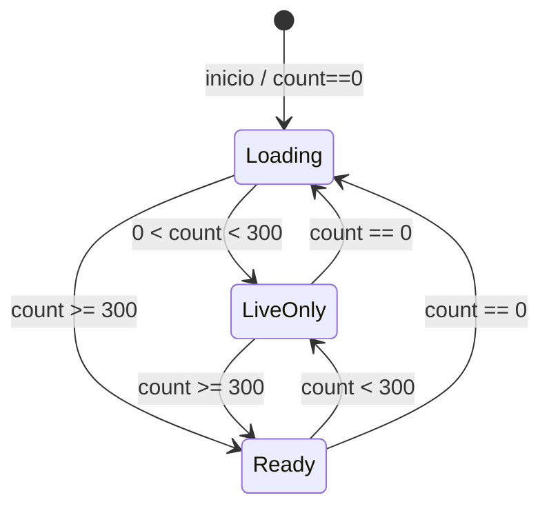
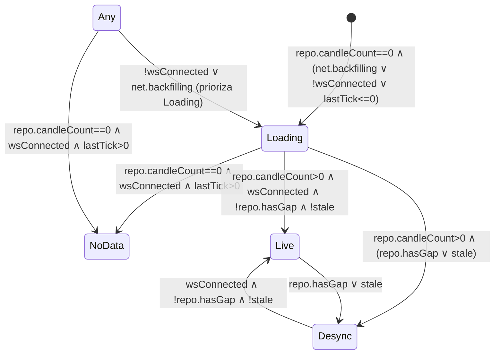
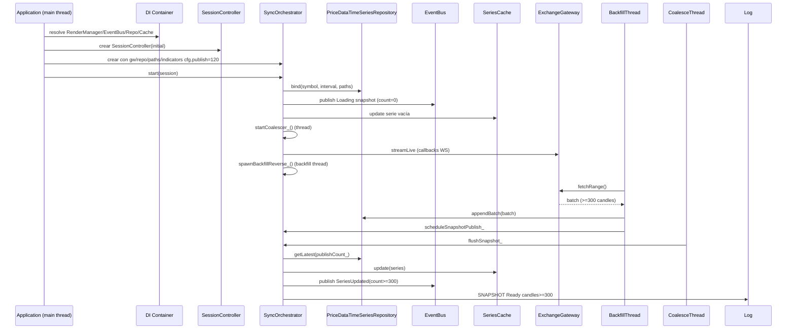
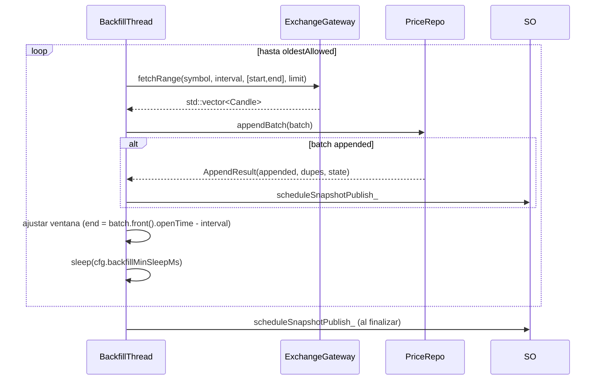
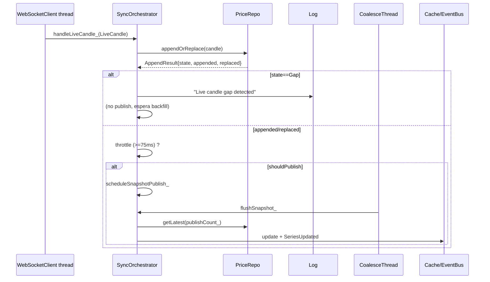
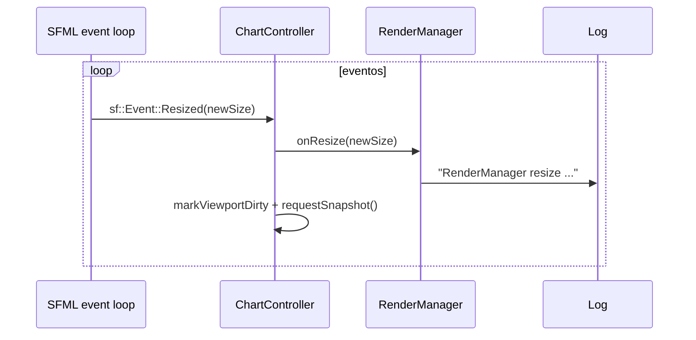
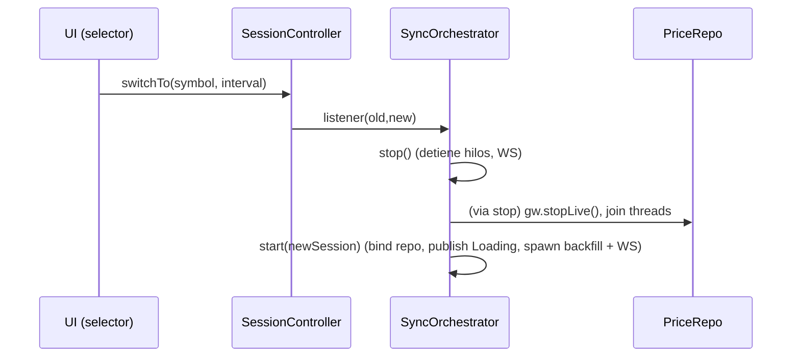

# Plan de diagnóstico para degradación 300→120 y flapping LiveOnly

## 1. Artefactos / inputs solicitados

| Prioridad | Ruta / símbolo | Propósito | Preguntas concretas |
|-----------|----------------|-----------|---------------------|
| Alta | `src/app/SyncOrchestrator.cpp::flushSnapshot_` | Confirmar reglas de recorte y transición `UiDataState`. | ¿`publishCount_` proviene de config a 120? ¿Se evalúa `count` luego de copiar desde repo? ¿Existe otro caller que reduzca `publishCount_` dinámicamente? |
| Alta | `src/app/ChartController.cpp::{setSeries,resetViewportToRecent}` | Validar resets de viewport y clamps. | ¿Quién llama `resetViewportToRecent` durante sesión? ¿Se clampa `candlesVisible` a tamaño actual de serie (ej. 120) cuando llega snapshot corto? |
| Alta | `src/core/EventBus.cpp::publishSeriesUpdated` + subscriptores en UI | Confirmar coalesce de eventos. | ¿Se descartan eventos cuando `count/first/last` coinciden? ¿Qué consumidores podrían reprocesar snapshots antiguos? |
| Alta | `src/app/RenderSnapshotBuilder.cpp::computeUiState` | Mapear degradaciones `UiState`. | ¿Cómo se propaga `repo.hasGap` / `net.backfilling` a mensajes UI? |
| Alta | `src/ui/RenderManager.cpp::onResize` + `Grid*/layout` | Detectar resize fantasma. | ¿Quién invoca `onResize` fuera de eventos SFML? ¿Se reutilizan instancias `RenderManager` por DI en múltiples escenas? |
| Media | `src/infra/storage/PriceDataTimeSeriesRepository.cpp::{appendBatch,appendOrReplace,getLatest}` | Reglas de slice y gaps. | ¿`getLatest(publishCount_)` siempre devuelve <= `publishCount_`? ¿`appendOrReplace` marca `RangeState::Gap` al detectar huecos WS? |
| Media | `src/app/Application.cpp::{run,handleEvents}` | Ciclo principal y vínculo con `RenderManager`. | ¿Quién dispara `RenderManager::onResize`? ¿Cómo se conectan snapshots a UI? |
| Media | `src/bootstrap/DIContainerConfigurator.*` | Ciclo de vida de singletons. | ¿`RenderManager`/`EventBus` son singleton? ¿Hay scopes por ventana? |
| Media | `src/infra/exchange/ExchangeGateway.cpp::fetchRange/streamLive` | Parámetros de backfill/gap handling. | ¿Se aplican clamps sobre respuesta? ¿fetchRange puede devolver <limit` consistentemente? |
| Baja | `src/app/SessionController.cpp` | Cambio de sesión. | ¿`switchTo` dispara `SyncOrchestrator::switchTo` sin reset adicional? |

## 2. Mapa de ownership y threads

```mermaid
graph LR
    subgraph MainThread[Hilo principal (SFML/UI)]
        Application --crea/posee--> RenderWindow
        Application --inyecta--> EventBus
        Application --inyecta--> RenderManager
        Application --inyecta--> ChartController
        ChartController --usa--> RenderManager
        ChartController --publica eventos--> EventBus
        RenderSnapshotBuilder --usado por--> Application
        GridModules[Grid* legacy] --lee--> DatabaseEngine
    end
    subgraph DataThreads[Hilos de datos]
        SyncOrchestrator --spawn--> BackfillThread
        SyncOrchestrator --spawn--> CoalesceThread
        ExchangeGateway --propaga--> WebSocketClient
    end
    subgraph SharedServices[Singletones DI]
        SeriesCache
        PriceRepo[PriceDataTimeSeriesRepository]
        DatabaseEngine
        ResourceProvider
        IndicatorCoordinator
    end

    Application -.resuelve vía DI .-> SyncOrchestrator
    Application --> SessionController
    SessionController --notifica--> SyncOrchestrator
    SyncOrchestrator --actualiza--> SeriesCache
    SyncOrchestrator --emite--> EventBus
    SyncOrchestrator --lee/escribe--> PriceRepo
    PriceRepo --persistencia--> DatabaseEngine
    ExchangeGateway --REST/WS--> PriceRepo
    WebSocketClient --callbacks en--> SyncOrchestrator
    IndicatorCoordinator --consume--> PriceRepo
    RenderSnapshotBuilder --consulta--> IndicatorCoordinator
```

**Relaciones clave (dueño → dependiente):**

| Dueño | Dependiente | Hilo predominante | Lifetime |
|-------|-------------|-------------------|----------|
| `Application` | `RenderWindow`, `RenderManager`, `EventBus`, `ChartController`, `SessionController`, `SyncOrchestrator` | Principal | Vive todo el proceso. |
| `SyncOrchestrator` | `BackfillThread` | Thread dedicado (`backfillThread_`) | Arranca en `start`, termina en `stop`. |
| `SyncOrchestrator` | `CoalesceThread` | Thread dedicado (`coalesceThread_`) | Arranca en `startCoalescer_`, se detiene en `stopCoalescer_`. |
| `SyncOrchestrator` | `SeriesCache`, `EventBus` (referencias inyectadas) | Acceso concurrente (protección por mutex/atomic) | Singletons DI. |
| `ExchangeGateway` | `WebSocketClient` | Hilo WS (callback) | Vive mientras `streamLive` activo. |
| `PriceDataTimeSeriesRepository` | `DatabaseEngine` | Principal + hilos datos (protección por `mtx_`) | Singleton DI atado a sesión. |
| `ChartController` | `RenderManager` | Principal | Persistente; responde a eventos y snapshots. |
| `Grid*` | `RenderManager`, `DatabaseEngine` | Principal (render) | Singletons DI legacy. |

## 3. Invariantes y FSM

### FSM `UiDataState`



* Fuente: `SyncOrchestrator::flushSnapshot_` decide estado según `series->data.size()` y umbral `kMinHistoryCandlesReady=300`. Un snapshot vacío mantiene `Loading`; `<300` degrada a `LiveOnly`; `>=300` promueve a `Ready`. 【F:src/app/SyncOrchestrator.cpp†L460-L483】

### FSM `UiState`



* `stale` se calcula como `(nowMs - net.lastTickMs) > 3 * intervalMs`. La autoridad temporal proviene de `std::chrono::system_clock` para `nowMs`, `repo.intervalMs` (histórico) y `net.lastTickMs` (WS). Gaps (`repo.hasGap`) o ticks atrasados promueven `Desync`. 【F:src/app/RenderSnapshotBuilder.cpp†L886-L928】
* La reconciliación REST+WS ocurre en `PriceDataTimeSeriesRepository::appendBatch/appendOrReplace`, que detectan gaps y actualizan `hasGap_`. `SyncOrchestrator::handleLiveCandle_` ignora publish si `RangeState::Gap` hasta que backfill repare. 【F:src/app/SyncOrchestrator.cpp†L374-L415】

## 4. Diagramas de secuencia

### Startup → primer `publish Ready`



### Backfill chunk (REST)



### Tick WS (sin gap)



### Resize



### Cambio de sesión



## 5. Instrumentación mínima propuesta

Agregar logs/contadores controlados por `#ifdef DIAG_SYNC` para habilitar sin impacto en release.

```cpp
// SyncOrchestrator::flushSnapshot_
LOG_INFO_DIAG("SYNC:flush", "sid=%llu state=%s count=%zu repoTotal=%zu first=%lld last=%lld tailHash=%016llx should=%d pubCount=%zu thread=%s",
              static_cast<unsigned long long>(sessionId_),
              uiDataStateLabel(uiState),
              count,
              repo_.candleCount(),
              series && !series->data.empty() ? series->data.front().openTime : 0,
              series && !series->data.empty() ? series->data.back().openTime : 0,
              core::hashTail(tail),
              publish,
              publishCount_,
              core::threadName());
```

* Añadir `publish` antes del guard de `shouldPublish_` para saber por qué se descartó.

```cpp
// SyncOrchestrator::handleLiveCandle_
LOG_DEBUG_DIAG("SYNC:live", "sid=%llu result=%s open=%lld final=%d appended=%d replaced=%d gap=%d schedule=%d",
               sid,
               toString(summary.state),
               live.candle.openTime,
               live.isFinal,
               summary.appended,
               summary.state == domain::RangeState::Replaced,
               summary.state == domain::RangeState::Gap,
               shouldPublish);
```

```cpp
// spawnBackfillReverse_/fetchRange
LOG_INFO_DIAG("SYNC:backfill", "sid=%llu window=[%lld,%lld] limit=%zu batch=%zu appended=%zu dupes=%zu total=%zu reason=%s",
              sid,
              range.start,
              range.end,
              limit,
              batch.size(),
              summary.appended,
              dupes,
              repo_.candleCount(),
              cutReason);
```

```cpp
// ChartController::resetViewportToRecent / setSeries
LOG_INFO_DIAG("UI:view", "caller=%s before=%zu after=%zu total=%zu rightmost=%lld initialized=%d", caller,
              prevVisible,
              currentView_.candlesVisible,
              series ? series->data.size() : 0,
              currentView_.rightmostOpenTime,
              initialized_);
```

```cpp
// RenderManager::onResize
static std::atomic<int> resizeBurst{0};
const auto count = resizeBurst.fetch_add(1, std::memory_order_relaxed) + 1;
LOG_INFO_DIAG("UI:resize", "size=%ux%u ignored=%d perSecond=%d",
              size.x,
              size.y,
              size == canvasSize_,
              count);
```

```cpp
// EventBus::publishSeriesUpdated
LOG_DEBUG_DIAG("BUS:series", "tid=%s count=%zu first=%lld last=%lld lastClosed=%d", core::threadName(), event.count, event.firstOpen, event.lastOpen, event.lastClosed);
```

**Contadores globales**: exponer métricas atómicas accesibles vía log periódico (`snapshots/s`, `resizes/s`, `series_coalesced`, backlog coalescer). Añadir flag CLI `--no-auto-viewport` para saltar `resetViewportToRecent` automático.

## 6. Hipótesis priorizadas y validación

| Nº | Hipótesis | Evidencia actual | Trazas esperadas | Cómo invalidar |
|----|-----------|------------------|------------------|----------------|
| H1 | `publishCount_` fijado en 120 → `getLatest(120)` → `count<300` ⇒ `LiveOnly`. | Config `SyncConfig.publishCandles` default 600. 【F:src/app/SyncOrchestrator.h†L46-L58】 | `SYNC:flush` debe mostrar `count=120`, `publishCount_=120`, aunque repo tenga `repoTotal` >> 300. | Instrumentar `flushSnapshot_` para loguear `repo_.candleCount()` y `publishCount_`. Ajustar config `publishCandles=600` y confirmar transición estable. |
| H2 | Viewport se resetea tras snapshot corto → UI clampa a 120 y queda atrapada. | `ChartController::resetViewportToRecent` clampa a `series_->data.size()`. 【F:src/app/ChartController.cpp†L84-L131】 | Log `UI:view` mostrará `before>=300`, `after=120`, `caller=resetViewportToRecent`, seguido de `UI:viewport reset` en logs. | Activar flag `--no-auto-viewport` y comprobar si degradación desaparece aun cuando `SyncOrchestrator` siga en 120. |
| H3 | WS detecta `RangeState::Gap` → no publica snapshot hasta backfill ⇒ flapping `LiveOnly` por slices parciales. | `handleLiveCandle_` abandona si `summary.state==Gap`. 【F:src/app/SyncOrchestrator.cpp†L374-L407】 | `SYNC:live` mostrará `gap=1` seguido de ausencia de `schedule`. `SYNC:backfill` mostrará ventana triggered por `gap`. | Introducir contador `gapTriggers` y correlacionar con `LiveOnly`. Si no hay gaps, descartar. |
| H4 | `RenderManager::onResize` se llama en ráfaga (quizá por reconstruir layout) → dispara snapshots (layout dirty). | `ChartController::attachWindow/setRenderManager` invocan `onResize` repetidamente. 【F:src/app/ChartController.cpp†L49-L75】 | `UI:resize` mostrará cientos de llamadas con mismo tamaño y `ignored=1`. | Agregar debounce (temporal) o contador y confirmar si se estabiliza. |
| H5 | `EventBus` coalesce suprime `SeriesUpdated` distintos en distintos hilos → UI queda con estado antiguo. | `publishSeriesUpdated` descarta eventos idénticos. 【F:src/core/EventBus.cpp†L70-L103】 | `BUS:series` mostrará eventos sin incremento de `count` pese a snapshots. | Añadir hash del payload antes/después y confirmar si se descartan indebidamente. |

## 7. Checklist de cierre

1. [ ] Confirmar mediante `SYNC:flush` y `PriceRepo` cuándo y dónde se recorta la serie a 120 (identificar función exacta y config).
2. [ ] Documentar transición `Ready → LiveOnly` con timeline (`count`, `repoTotal`, `UiState`).
3. [ ] Aislar origen de la tormenta de `SNAPSHOT` (¿coalesceThread? ¿loop de `pendingSnapshot_`?).
4. [ ] Medir contadores de resize fantasma y, si existen, trazar el caller.
5. [ ] Verificar si `LiveOnly` coincide con gaps WS (contadores `gapTriggers`, `backfill` windows).
6. [ ] Entregar parches de diagnóstico (`#ifdef DIAG_SYNC`, flag `--no-auto-viewport`) listos para revertir tras RCA.
7. [ ] Validar que la instrumentación no degrada performance (solo logs a nivel INFO limitado por rate-limiter).

